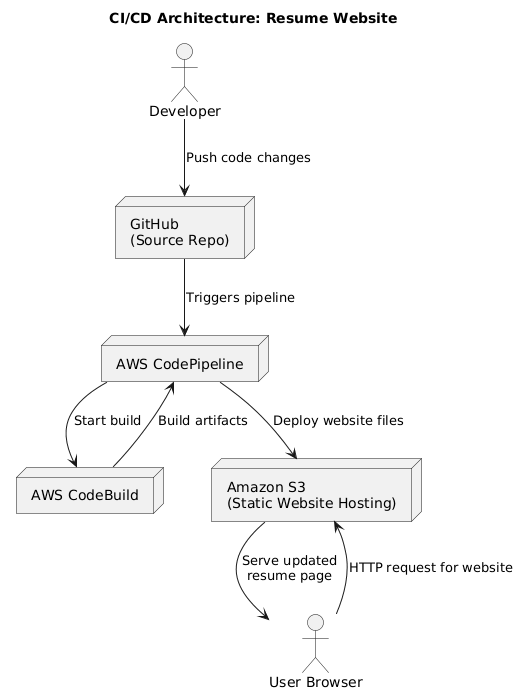

# CI/CD Pipeline for Resume Website

## 1. Architecture Overview

- Static resume site hosted on Amazon S3 (static website hosting).
- GitHub repository as single source of truth.
- AWS CodePipeline:
  - Source: `main` branch on GitHub.
  - Build: CodeBuild project `nolanwai-devops-a4-build` using `buildspec.yml`.
  - Deploy: Deploy to S3 bucket `nolanwai-devops-a4`.
  - Monitoring: CloudWatch logs + alarms.

## 2. Setup Steps

1. Create S3 bucket and enable static hosting.
2. Create GitHub repository and push website code.
3. Create CodeBuild project and `buildspec.yml`.
4. Create CodePipeline with Source/Build/Deploy stages.
5. Configure CloudWatch alarms for CodeBuild fails.

## 3. Maintenance

- How to add new pages / update styles.
- How to debug failed pipeline runs (look at CodeBuild logs).
- How to rotate credentials / update GitHub connection.

## 4. Troubleshooting

- Pipeline fails at Source: check GitHub connection and auto deploy for changes.
- Pipeline fails at Build: check the buildspec.yml (make sure the file structures are correct).
- Pipeline fails at Deploy: verify S3 permissions and bucket name.
- Website shows old version: check browser cache, confirm pipeline ran.
